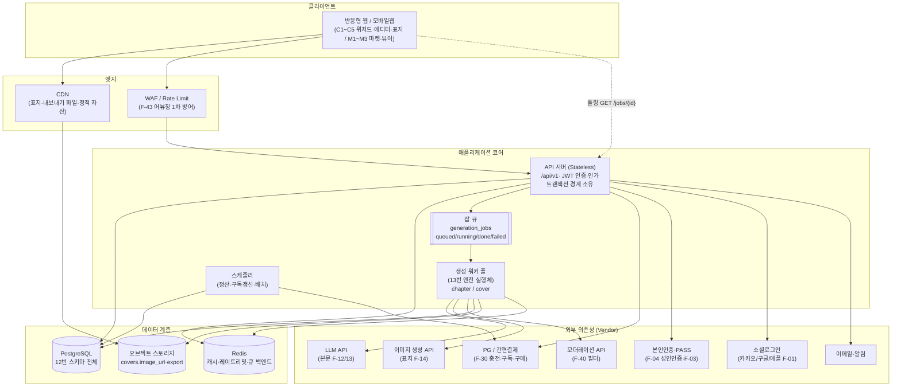

# 기술 아키텍처 및 인프라 설계

> 작성: 시니어 아키텍트 / 최종수정: 2026-06-29

> `11_기능명세서.md`의 기능(F-xx)·`12_DB_API_명세.md`의 스키마/엔드포인트를 **"어디서 어떻게 돌리는가"**의 인프라 관점으로 구체화한 문서.
> AI 생성 파이프라인의 **프롬프트 로직·일관성 엔진 내부 설계는 `13_AI생성엔진_설계.md`로 위임**하고, 본 문서는 그 엔진의 실행 환경(큐·워커·스케일·원가·관측)에 집중한다.
> 전제: 한국 스타트업 소규모 팀(개발 2~4명). **관리형 서비스 우선, 운영 인력 최소화**가 모든 선택의 기준.

---

## 0. 🧭 설계 원칙 (Design Tenets)

| # | 원칙 | 근거 |
| :-: | --- | --- |
| 1 | **AI 원가 = 1순위 리스크** → 인프라가 원가를 깎는다 | `00` 핵심 리스크 "쓸수록 적자", F-12 AC "원가/토큰 로깅" |
| 2 | **생성은 무조건 비동기** (요청-응답 분리) | F-12, `12` 2-3 `generation_jobs` + `GET /jobs/{id}` 폴링 |
| 3 | **금전·크레딧은 단일 트랜잭션 + 멱등키** | `12` 3장 무결성 규칙 |
| 4 | **MVP는 단순하게, 성장기에 분리** | `00` 로드맵 Phase 1→3 |
| 5 | **개인정보·미성년 보호는 인프라 기본값** | `06` 리스크, F-04/F-31, `12` "성인인증 결과만 저장" |
| 6 | **모델/단가/분량은 config, 하드코딩 금지** | F-12 전제, `09` 원칙 |

---

## 1. 🏗️ 시스템 아키텍처 구성도



**읽는 법**: 동기 트래픽(가입·결제·조회)은 `WEB→API→RDB`로 즉시 응답. 무거운 생성(F-12/F-14)은 `API`가 잡만 등록(`202 Accepted`)하고 `WORKER`가 백그라운드에서 외부 LLM/이미지 API를 호출. 클라이언트는 `GET /jobs/{id}`로 진행률(C3 생성 로딩 화면)을 폴링한다.

---

## 2. 🛠️ 기술 스택 권장안

> 선택 기준: **(a) 관리형 우선 (b) 한국 결제·인증 생태계 호환 (c) 채용 가능한 흔한 스택 (d) 비동기/큐 1급 지원**

| 영역 | 권장 | 근거 (1줄) |
| --- | --- | --- |
| **프론트** | Next.js (React) + TypeScript | 반응형 웹 단일 코드(F-1 전제 "반응형 웹"), SSR로 마켓 SEO(M1/M2 작품 노출) |
| **상태/폴링** | TanStack Query | `GET /jobs/{id}` 폴링·캐시 무효화에 표준화된 패턴 |
| **백엔드** | NestJS(Node/TS) 또는 FastAPI(Python) | 프론트와 TS 공유(Nest) vs AI SDK 친화(FastAPI). **AI 비중 높아 FastAPI 권장** |
| **DB** | **PostgreSQL** (관리형: Supabase/RDS/Cloud SQL) | `12` 명시 전제, `jsonb`(novel_settings·relationships.timeline) 강점 |
| **큐/워커** | **Redis + 잡 큐**(BullMQ/Celery/RQ) → 성장기 SQS/Cloud Tasks | 소규모는 Redis 하나로 캐시+큐 겸용, 운영 단순 |
| **캐시** | **Redis** | 마켓 랭킹·세션·레이트리밋·멱등키 저장 겸용 |
| **스토리지** | S3 호환 오브젝트 스토리지 + CDN | `covers.image_url`·내보내기 파일, 원본 트래픽 분리 |
| **인프라** | 단일 클라우드(AWS 또는 NCP) + 컨테이너(ECS/Cloud Run) | NCP는 PASS·국내 PG 연동·데이터 국내보관 유리, AWS는 생태계 우위 |
| **IaC** | Terraform (또는 관리형 콘솔 + 최소 스크립트) | 환경 재현·staging/prod 동등성 |
| **CI/CD** | GitHub Actions | 무료 티어·관리형, 별도 CI 서버 불필요 |

> 💡 **MVP 권장 조합**: `Next.js(Vercel) + FastAPI(Cloud Run/ECS) + Supabase(Postgres) + Redis(관리형) + S3+CloudFront`. 서버 운영 부담을 최소화하고 P0 검증(`09`)에 집중.

---

## 3. ⚙️ 비동기 생성 파이프라인 인프라 (F-12 / F-14)

> 내부 프롬프트 구성·이전 회차 맥락 누적·관계도 일관성 로직 → **`13_AI생성엔진_설계.md` 참조.** 여기서는 실행 인프라만 다룬다.

### 3-1. 잡 수명주기 (인프라 레벨)

```
[C4 "다음 회차 생성" / C5 "표지 생성" 클릭]
  → API: POST /novels/{id}/chapters/generate (또는 /cover/generate)
       1) 인가 검증 (소유자 / 19금이면 is_adult_verified)
       2) 크레딧 잔액 확인 → 부족 시 403 INSUFFICIENT_CREDIT (차감 안 함)
       3) generation_jobs INSERT (status=queued) + 큐에 enqueue
       4) 즉시 202 { job_id, status:"queued" }  ← 여기서 응답 종료
  → WORKER (별도 프로세스):
       5) 잡 dequeue → status=running, progress 갱신
       6) 13번 엔진: 설정+이전회차+관계 프롬프트 구성 → 외부 LLM/이미지 호출
       7) 성공: chapters(또는 covers) INSERT(gen_cost·gen_model 기록)
                + wallet_transactions 크레딧 차감 → 단일 TX 커밋 → status=done
          실패: 차감 없이 status=failed, error 기록 (크레딧 미차감 = 롤백 보장)
  → CLIENT: C3 로딩 화면에서 GET /jobs/{job_id} 폴링 → done/failed 표시
```

### 3-2. 워커 스케일링

| 항목 | MVP | 성장기 |
| --- | --- | --- |
| 워커 형태 | API와 별도 컨테이너 1~2개, Redis 큐 구독 | 잡 `type`별 큐 분리(chapter / cover) + 독립 오토스케일 |
| 스케일 트리거 | 수동/CPU | **큐 길이(대기 잡 수) 기반** 오토스케일 — 외부 API 대기가 I/O 바운드라 동시성↑ |
| 동시성 제어 | 워커당 N 동시 잡 제한 | 벤더 rate limit에 맞춘 **글로벌 동시성 토큰**(Redis 세마포어)로 LLM 429 방지 |
| 우선순위 | 단일 큐 | 유료(Pro) 사용자 우선 큐 / Free 지연 큐 분리 가능 |

### 3-3. 타임아웃·재시도·멱등성

| 관심사 | 설계 |
| --- | --- |
| **타임아웃** | 잡당 hard timeout(예 회차 90s/표지 120s, config). 초과 시 `failed` + 크레딧 미차감 |
| **재시도** | 외부 API 5xx/429/네트워크 오류만 지수백오프 **최대 N회** 자동 재시도. 콘텐츠 검열 거부 등 4xx는 재시도 금지 |
| **멱등성** | `generate` 요청은 `Idempotency-Key` 헤더(`12` 3장) → 같은 키 재요청 시 기존 job_id 반환(중복 잡·중복 차감 방지). 워커 처리도 job_id 단위 1회 보장 |
| **중복 차감 방지** | 크레딧 차감은 **잡 성공 시 1회만**, `wallet_transactions.ref_id = job_id`로 가드 |
| **DLQ** | 재시도 소진 잡은 Dead Letter Queue로 격리 → 관측성 알림 → 수동 검토/환불 |

### 3-4. ⚠️ 실패 시 크레딧 롤백 — 트랜잭션 경계

핵심: **외부 AI 호출은 트랜잭션 "밖", 크레딧 차감은 트랜잭션 "안".**

```
BEGIN TX  ← 절대 외부 LLM 호출을 이 안에 두지 않는다 (DB 커넥션 장시간 점유 금지)
  -- (사전: AI 호출은 이미 끝나 결과를 메모리에 들고 있음)
  INSERT chapters(content, gen_cost, gen_model, status='done')
  INSERT wallet_transactions(asset='credit', amount=-N,
         reason='generate_chapter', ref_id=job_id, balance_after=...)
  UPDATE wallets SET credit_balance = credit_balance - N
  UPDATE generation_jobs SET status='done', progress=100
COMMIT
```

- AI 호출 **실패**: 위 TX 자체를 시작 안 함 → 잔액 그대로(자연 롤백). `jobs.status=failed`만 별도 기록.
- AI 호출 **성공 후 DB 커밋 실패**: TX 원자성으로 전부 롤백 → 잡 재처리 or DLQ. 사용자 크레딧은 안전.
- 결과적으로 F-12 AC **"생성 실패 시 크레딧 미차감·재시도"** 보장.

---

## 4. 🔌 외부 의존성 매트릭스

| 의존성 | 기능 | 용도 | 장애 시 폴백 | 벤더 락인 리스크 |
| --- | --- | --- | --- | --- |
| **LLM API** (본문) | F-12/F-13 | 회차 본문 생성 | **멀티 프로바이더 추상화**(13번 모델 라우팅) → 2차 벤더로 페일오버, 큐 보존 후 재처리 | **상(High)** — 어댑터 계층으로 모델 교체 가능하게, `gen_model`로 추적 |
| **이미지 생성 API** (표지) | F-14 | 표지 후보 N개 | 대체 이미지 벤더 / 재시도 / 기본 템플릿 표지 제공 | 중 — 표지는 본문보다 교체 용이 |
| **PG·간편결제** | F-30 | 충전·구독(billing_key)·구매 | 결제 실패 즉시 사용자 안내, 재시도 유도. 정기결제 실패 시 유예·재청구 | 중 — `subscriptions.pg_billing_key` 벤더 종속, 다중 PG 권장 |
| **본인인증·PASS** | F-04(AV)/F-03 | 성인인증·법정대리인 | 인증기관 점검 시 19금 액션 일시 차단(차단이 안전). 다중 인증수단(pass/ipin/card) | 중 — `method` enum으로 수단 추상화 |
| **소셜로그인** | F-01 | 카카오/구글/애플 | 한 제공자 장애 시 타 제공자·이메일 로그인 유지 | 하 — 표준 OAuth, `auth_provider` enum |
| **모더레이션 API** | F-40 | 입력/결과 유해성 스코어 | 외부 장애 시 **보수적 차단** + 사람 검수 큐(O1)로 폴백 | 하 |
| **이메일·알림** | 전반 | 정산·검수·결제 알림 | 큐잉 후 재전송, 비핵심이라 지연 허용 | 하 |

> **공통 원칙**: 모든 외부 호출은 **타임아웃 + 서킷브레이커 + 재시도**로 감싸고, 키는 비밀관리(§6)로 주입. 안전이 걸린 의존성(PASS·모더레이션)은 **장애 시 "차단" 쪽으로 fail-safe**.

---

## 5. 🗄️ 데이터·스토리지 전략

| 데이터 종류 | 저장소 | 비고 |
| --- | --- | --- |
| 회원·작품·설정·회차·거래 일체 | **PostgreSQL** (`12` 스키마 전체) | 금전 테이블(wallets·purchases·donations·payouts)은 트랜잭션 정합성이 생명 |
| `novel_settings`·`relationships.timeline`·`characters` | Postgres `jsonb` | 스키마 변경 없이 항목 확장(`12` 설계의도) |
| **표지 이미지** (`covers.image_url`) | 오브젝트 스토리지 + CDN | 원본은 스토리지, 서빙은 CDN. Free 워터마크본/원본 분리 가능 |
| **내보내기 파일**(epub/txt 등) | 오브젝트 스토리지(서명 URL, 만료 부여) | 구매자 다운로드는 짧은 만료의 presigned URL |
| 세션·랭킹·멱등키·레이트리밋 | **Redis** | 아래 캐시 대상 참고 |

### 캐시 대상 (Redis)
- 마켓 홈/랭킹(M1 베스트셀러·신작) — 읽기 폭주, 짧은 TTL.
- 작품 판매페이지(M2) 공개 메타·미리보기 — TTL + 갱신 시 무효화.
- `/me` 인증상태·잔액 — 짧은 캐시(결제·생성 직후 무효화).
- 멱등키·레이트리밋 카운터·LLM 동시성 세마포어.
- **생성 결과 캐싱**은 §9(원가 절감)에서 별도 처리.

> DB는 **읽기 트래픽 증가 시 읽기 복제본(read replica)**, 금전·생성 쓰기는 프라이머리. MVP는 단일 인스턴스로 시작.

---

## 6. 🌱 환경 구성 · 비밀관리 · CI/CD

### 6-1. 환경 분리

| 환경 | 용도 | 외부 의존성 |
| --- | --- | --- |
| **dev** | 로컬/개발 | LLM·PG·PASS는 **목/샌드박스**(원가 0, 결제 미발생) |
| **staging** | 출시 전 검증·QA | 벤더 샌드박스 + prod 동일 구성(축소판) |
| **prod** | 실서비스 | 실 키·실 결제. 데이터 국내 보관(개인정보) |

- 환경별 **별도 DB·스토리지·키**. staging↔prod 데이터 격리 필수(개인정보 유출 방지).
- 모델/단가/분량 등은 **환경별 config**(F-12 전제, 하드코딩 금지) — prod에서 모델 교체·단가 조정이 배포 없이 가능하도록 config/원격 설정 분리.

### 6-2. 비밀관리
- LLM·PG·PASS·OAuth 키는 **시크릿 매니저**(AWS Secrets Manager / NCP / Vault)에 보관, 런타임 주입. 코드·리포지토리 평문 금지.
- 결제·인증 키는 prod 전용 권한 분리, 정기 로테이션.

### 6-3. CI/CD (GitHub Actions)
```
PR → 린트·타입체크·유닛테스트 → 빌드(컨테이너 이미지)
   → staging 자동 배포 → 스모크테스트
   → 수동 승인 → prod 배포 (블루/그린 or 롤링)
DB 변경 → 마이그레이션(버전관리, 자동 적용 + 롤백 스크립트)
```
- **워커와 API는 동일 이미지/별 배포 단위** — 워커만 독립 스케일.
- 시크릿은 GitHub Actions Secrets → 배포 시 시크릿매니저 경유.

---

## 7. 📈 관측성 (Observability)

> 특히 **생성 잡 성공률·지연·토큰 원가**는 사업 생존지표(`00` AI원가 리스크, F-12 AC 원가/토큰 로깅, `12` `gen_cost`/`gen_model`)와 직결 → 1급 메트릭으로 취급.

| 축 | 도구(권장) | 핵심 항목 |
| --- | --- | --- |
| **로깅** | 구조화 로그(JSON) → 중앙 수집 | 요청ID·user_id·job_id 상관관계. 개인정보·인증원본 **로그 금지** |
| **메트릭** | Prometheus/Grafana 또는 관리형 APM | 아래 ★ 생성 지표 + API p95 지연·에러율 |
| **트레이싱** | OpenTelemetry | API→큐→워커→외부API 분산 추적(병목·외부 지연 식별) |
| **알림** | Slack/PagerDuty | DLQ 적재, 생성 실패율 급등, PG/PASS 장애, 일일 토큰원가 임계 초과 |

### ★ 생성 잡 대시보드 (필수)
- **성공률**: `done / (done+failed)` (잡 타입별·모델별).
- **지연**: 큐 대기시간 + 워커 처리시간 p50/p95(C3 이탈과 직결).
- **토큰 원가**: `gen_cost` 집계 → **사용자당/회차당 평균 원가 vs 크레딧 단가** 비교(흑자선 모니터링, `09` 신호등 데이터화).
- **모델별 원가/품질**: `gen_model` 차원으로 라우팅 의사결정 근거 제공(§9 연계).

---

## 8. 🔐 보안

| 영역 | 설계 | 연계 |
| --- | --- | --- |
| **인증** | JWT Bearer(`12` 2-0). 소셜 OAuth + 이메일 | F-01 |
| **인가** | `users.role`(user/creator/admin) 서버 검증. 작품 수정·정산=소유자, 검수·제재=admin only | `12` 3장 권한 |
| **19금 게이트** | 19금 생성/열람/구매/판매 전 **서버에서 `is_adult_verified` 재검증**(클라 신뢰 금지) | F-04, AV |
| **미성년 보호** | `birth_date` 기반 결제 한도 **서버 재검증**, 고액·19금 차단 | F-31, `06` |
| **개인정보 최소수집** | 성인인증은 **결과(result)만 저장, 원본 최소 보관**(`age_verifications`). 인증원본 로그·캐시 금지 | F-04, AV 설계원칙 |
| **레이트리밋·어뷰징** | WAF + Redis 토큰버킷(IP·계정·엔드포인트별). 생성/충전/후원 엔드포인트 강화 | F-43 FDS 연계 |
| **부정거래(FDS)** | 자전거래·환불 어뷰징·리뷰조작 패턴 → 비동기 스코어링 → 의심 시 **정산 홀드**(payout_hold) + 검수 큐(O1) 합류 | F-43, F-42 |
| **데이터 암호화** | 전송 TLS, 저장 시 DB/스토리지 암호화. 결제는 **PCI를 PG에 위임**(카드정보 비저장) | `11` 보안 전제 |
| **멱등·중복결제 방지** | 충전·구매·후원·생성에 `Idempotency-Key` | `12` 3장 |

---

## 9. 💸 확장성·비용 민감 설계 — 인프라가 AI 원가를 어떻게 줄이는가

> `00` 1순위 리스크 "AI 원가 > 판매가". 인프라 레벨의 3대 레버:

### (1) 캐싱
- **프롬프트/컨텍스트 캐싱**: 작품 설정·관계도·세계관 등 회차 간 반복되는 컨텍스트는 LLM **프롬프트 캐시**로 재과금 회피(긴 누적 맥락이 원가 주범이라 효과 큼). 상세 컨텍스트 구성은 13번.
- **결과 캐싱**: 표지 스타일 프리뷰·관계 자동추천(F-11 suggest) 등 결정적 입력은 결과 재사용.
- **읽기 캐시**: 마켓 랭킹·판매페이지(M1/M2)는 Redis로 DB 부하·비용 절감.

### (2) 모델 라우팅 (config 기반, 13번 정책 구현)
- **작업 난이도별 모델 차등**: 초안/짧은 분량은 저가 모델, 핵심 회차·재생성은 고가 모델. `gen_model`로 추적·A/B.
- **등급별 차등**: Free는 저가 모델·워터마크 표지(F-14 AC), Pro는 고품질. 단가에 원가 반영(`00` P0).
- 모델은 **config/원격설정**으로 무중단 교체 → 벤더 가격 변동·신모델 대응.

### (3) 배치·동시성·페일오버
- **일괄 생성**(F-12 `mode` 일괄)은 워커가 묶어 처리해 오버헤드·왕복 절감.
- **글로벌 동시성 토큰**으로 429/페널티 회피, 재시도 폭주(=원가 폭증) 차단.
- **DLQ + 자동 환불/롤백**으로 실패 잡이 무한 재시도로 과금되는 사고 방지.
- **일일 토큰원가 임계 알림**(§7)으로 비정상 소비를 조기 차단.

---

## 10. 🚀 MVP vs 확장기 인프라

| 구성요소 | MVP (Phase 1, `00` 로드맵) | 확장기 (Phase 2~3) |
| --- | --- | --- |
| API/워커 | 같은 코드, 별 프로세스 1~2개 | 잡 타입별 워커 분리 + 큐길이 오토스케일 |
| 큐 | Redis 단일(캐시 겸용) | 전용 큐(SQS/Cloud Tasks) + 우선순위·DLQ 강화 |
| DB | 관리형 Postgres 단일 | read replica·파티셔닝(chapters/wallet_transactions 증가 대응) |
| 스토리지 | S3 + CDN | 동일(이미 확장형) |
| LLM | 단일 벤더 + 어댑터 추상화 | 멀티 벤더 라우팅·페일오버(§4/§9) |
| 마켓/검수 | 최소(F-20~24, 수동 검수) | FDS(F-43)·표절검사(F-50) 자동화 파이프라인 |
| 관측성 | 로그 + 생성원가 대시보드(필수) | 풀 트레이싱·SLA·이상탐지 알림 |
| 결제 | 단일 PG·간편결제 | 다중 PG 페일오버 |

> **원칙**: MVP는 "Redis 하나 + 관리형 Postgres + 컨테이너 2~3개"로 P0(수요·원가) 검증에 집중. 트래픽·매출이 흑자선(MAU 3만, `00`)에 근접하면 큐·DB·워커를 순차 분리.

---

### 연관 문서
- `11_기능명세서.md` — 기능 ID(F-01·F-04·F-12·F-14·F-30·F-31·F-32·F-40·F-43 등) 정의
- `12_DB_API_명세.md` — 스키마(`generation_jobs`·`wallet_transactions`·`covers`·`age_verifications` 등)·엔드포인트·무결성 규칙
- `13_AI생성엔진_설계.md` — 비동기 생성 파이프라인 내부(프롬프트 아키텍처·맥락 누적·관계도 일관성 엔진·모델 라우팅 정책)
- `04_화면구성_및_관계성.md` — 화면 ID(C3 생성 로딩·AV 성인인증·P1 결제·O1 검수 큐)
- `06_리스크대응_및_정책방안.md` — 미성년 보호·개인정보·검수 3단 방어선
- `00_사업계획_요약_1pager.md` — AI 원가 리스크·로드맵 Phase 구분
