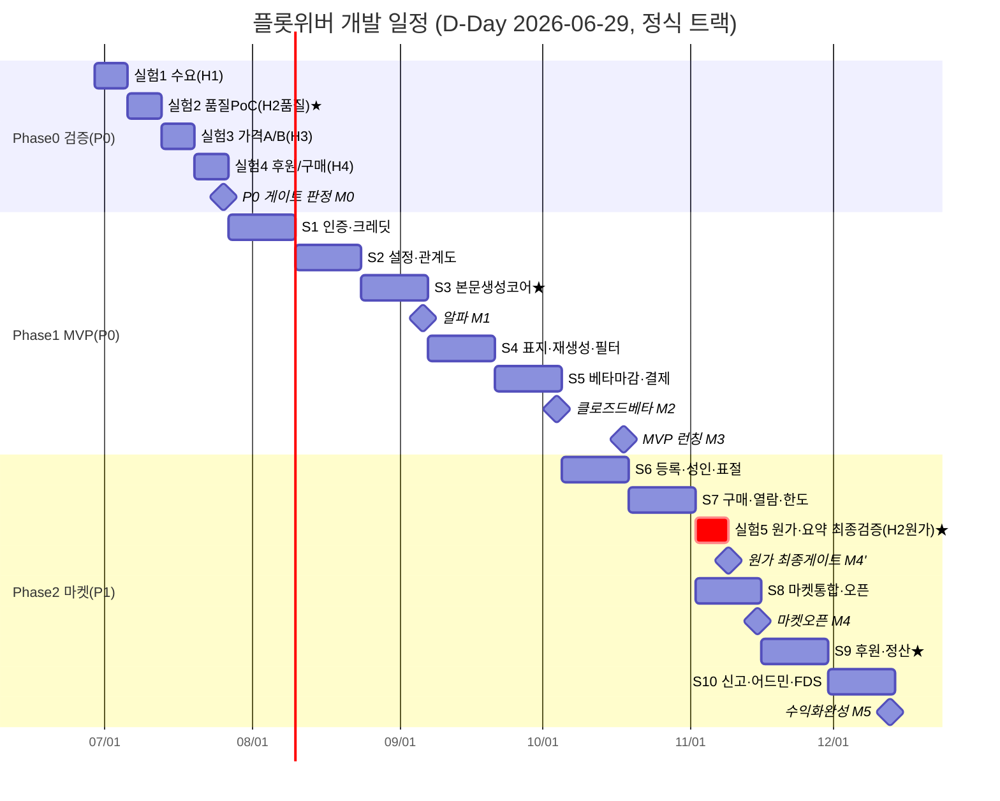

# 개발 일정 및 리소스 플랜

> 플롯위버(PlotWeaver) — AI 웹소설 생성+수익화 플랫폼의 개발 실행 일정·인력·예산 플랜
> 기준일: **2026-06-29**(모든 상대일정의 D-Day). 게이트 통과 가정 하의 직렬 일정 — 게이트 미통과 시 해당 지점에서 정지/재실험.
> 작성: 개발 PM / 최종수정: 2026-06-29

---

## 0. 🧭 이 문서의 전제 (정합성 기준)

이 일정은 아래 문서의 정의를 **그대로 인용**해 짠다. 숫자·코드를 임의로 바꾸지 않는다.

| 출처 | 인용하는 것 |
| --- | --- |
| `00_사업계획_요약_1pager.md` | 로드맵 Phase 0~4, **"P0(수요·품질) 통과 전 본개발 금지"**(원가 검증은 최종 단계로 이연, `09` §1) |
| `09_베타_실험_설계서.md` | 검증 4주·100만원, 가설 H1~H4, **P0=H1·H2** |
| `11_기능명세서.md` | 기능코드 F-01~F-50, 우선순위 P0/P1/P2, 7장 **스프린트 묶음 S1~S4** |
| `12_DB_API_명세.md` | 테이블·엔드포인트, **금전 트랜잭션 무결성·`gen_cost` 원가 로깅** |
| `04_화면구성_및_관계성.md` | 화면 ID(C1~C5, M1~M3, S1~S2, O1~O3…)·플로우 |
| `14_기술아키텍처`·`15_지표체계도` | (생성 예정) — 인프라 스택·KPI 확정 시 본 일정의 인프라/마일스톤 지표에 반영 |

> ⚠️ 핵심 설계 제약(`09`·`11`): **AI 모델·생성단가·회차분량·생성단위는 `config`로 분리(하드코딩 금지).** 일정상 Sprint 1에서 이 config 골격을 먼저 깐다. 그래야 "나중에 모델/가격/UX만 손본다"는 전략이 코드로 성립한다.

---

## 1. ⚖️ 전제·제약과 두 개의 시작 트랙

### 1-1. 일정을 지배하는 4대 원칙
1. **검증 우선(Validation-First)**: P0(H1 수요·**H2 품질/일관성**) 게이트 통과 **전에는 본개발 라인을 잠근다.** Phase 0 종료 = 본개발 착수 결재선.
2. **원가 검증은 최종 단계(2026-06-29 결정, `09` §1)**: 토큰 원가 정밀 측정 + 요약방식 검증은 **모델 확정 시점(개발 후반/출시 직전)** 으로 이연한다. AI 모델·단가·분량을 **config로 분리**해 "마지막에 숫자만 조정". 단 **토큰 로깅은 Sprint 3(생성 연동)부터 상시 적재**(소급 불가). ⚠️ 원가가 분량·생성단위 변경을 요구할 구조 리스크는 감수(R1).
3. **도구 먼저, 마켓 작게(`00`)**: P0 = 생성 도구(S1·S2)까지가 MVP. 마켓·후원(S3·S4)은 그 다음.
4. **컷 가능 설계**: 일정 압박 시 P1을 차기로 미루되 **P0 Aha 3종은 사수**(8장 참조).

### 1-2. 두 개의 시작 트랙 (둘 다 같은 게이트를 통과)
"나 혼자/소규모로 먼저 테스트"한다는 가정을 반영해 **부트스트랩 트랙**을 정식 트랙과 분리한다. 게이트·산출물은 동일, 기간·범위만 다르다.

| 구분 | 🅰️ 부트스트랩 트랙 (1~2인) | 🅱️ 정식 팀 트랙 (4~6인) |
| --- | --- | --- |
| 목적 | 내 돈·내 시간으로 P0와 핵심 Aha만 증명 | P0 통과 후 풀 MVP→마켓까지 빠르게 |
| Phase 0(검증) | 동일 4주 (혼자 랜딩+PoC) | 동일 4주 (병렬로 더 깊게) |
| MVP 범위 | **P0 Aha 3종 + 결제 1종**으로 축소(8장) | F-01~F-15 + F-30 전체 |
| 속도 계수 | 정식 대비 약 **1.6~2.0배** 기간 | 기준(1.0배) |
| 외주 의존 | 디자인·표지 템플릿 외주로 인력 대체 | 사내 디자이너 |
| 전환 시점 | P0 통과 + 유료전환(H3) 신호 확인 후 채용으로 전환 | 처음부터 정식 |

> 부트스트랩 트랙은 **"증명할 최소한"만** 만든다. 아래 2~4장 메인 타임라인은 🅱️ 정식 트랙 기준이며, 🅰️는 각 Phase 말미에 "부트스트랩 변형"으로 표기한다.

---

## 2. 🗓️ 단계별 타임라인 (Phase 0→4)

각 Phase = **진입조건(Gate-In) → 작업 → 종료조건(Gate-Out)**. 종료조건을 못 채우면 다음 Phase로 못 넘어간다.

| Phase | 기간(정식) | 상대일정(2026) | 진입조건(Gate-In) | 종료조건(Gate-Out) |
| --- | --- | --- | --- | --- |
| **0. 검증** | 4주 | 06-29 ~ 07-26 | (착수) 랜딩·PoC 준비 | **H1 수요 ✅ + H2 품질(30화 일관성) ✅** → 본개발 잠금 해제 *(원가는 최종 게이트로 분리)* |
| **1. MVP(P0)** | 10주(5스프린트) | 07-27 ~ 10-04 | Phase 0 P0 Go 결재 | "설정→1회차+표지" 동작, 핵심 Aha 3종 동작, 결제(크레딧) 동작 → **클로즈드 베타** |
| └ (유료화 검증) | 베타 중 2주 | 09-21 ~ 10-04 | MVP 생성 흐름 완성 | **H3 전환율 ≥3% 신호**(가격 A/B, `09` 실험3) |
| **2. 마켓(P1)** | 8주(4스프린트) | 10-05 ~ 11-29 | MVP 런칭 + H3 신호 | 판매·구매·검수·후원·정산 동작 → **마켓 오픈** |
| **3. 성장** | 조건부(상시) | 11-30 ~ | MAU·리텐션 기준선 확보 | Pro 요금제·추천 알고리즘·창작자 락인 지표 개선 |
| **4. 확장** | 조건부 | (성장 안정 후) | 흑자 근접(MAU 3만, `00`·`08`) | IP 2차활용(웹툰화 등) 파일럿 |

> Phase 3·4는 **날짜가 아니라 조건(게이트)으로 트리거**한다. MAU/리텐션/원가마진이 기준선 미달이면 Phase 2 보강에 머문다(막연한 "약 N개월" 진입 금지).

### Phase 0 상세 (검증 4주 · `09` 그대로)
| 주 | 상대일정 | 실험 | 가설 | 성공 기준(게이트) |
| :-: | --- | --- | :-: | --- |
| W1 | 06-29~07-05 | 실험1 수요(랜딩+가짜문, 광고 50만) | H1 | 랜딩→이메일 전환 **≥8%**, CPL **≤3,000원** |
| W2 | 07-06~07-12 | 실험2 **품질·일관성** PoC(본문30화) | **H2(품질)** | 30화 일관성 붕괴 **≤20%**, 관계전환 빌드업 자연스러움 |
| W3 | 07-13~07-19 | 실험3 지불의사(가격 A/B 9,900 vs 14,900) | H3 | 무료→유료 **≥3%**, 결제완료율 **≥60%** |
| W4 | 07-20~07-26 | 실험4 후원/구매(컨시어지 수동) | H4 | 후원율·구매율 각 **≥1%** |
| — | 07-26 | **🚦 P0 게이트 판정** | — | H1·H2(품질) 둘 다 ✅이면 Go. 하나라도 ❌이면 `09` 의사결정 매트릭스대로 재설계/Pivot |
| **(최종)** | 출시 직전 | **실험5 토큰 원가·요약방식**(모델 확정 시) | **H2(원가)** | 회차 원가<판매가(마진≥0). 미달 시 단가↑/모델↓/(구조)분량·단위 조정 |

> **부트스트랩 변형(🅰️)**: W1·W2(H1·품질)만 "혼자" 수행해도 본개발 잠금 해제 가능. W3·W4는 MVP 베타 중으로 미뤄 비용을 줄인다. **원가(실험5)는 모델 확정 후 최종 단계.**

---

## 3. 🧩 스프린트 분해 (2주 단위 · F-코드 배치)

`11` 7장 스프린트 묶음(S1~S4)을 **2주 스프린트 10개**로 분해. 의존관계(F-10→F-11→F-12, F-30 선행 등)를 순서에 반영.

| 스프린트 | 상대일정(2026) | 묶음 | 배치 F-코드 | 산출물 / 의존 처리 |
| --- | --- | :-: | --- | --- |
| **Sprint 1** 기반·인증·크레딧 | 07-27~08-09 | S1 | F-01, F-02, **F-30(크레딧)**, +`config`골격·DB스키마·CI | 인증/약관 + 지갑·크레딧 차감 토대. **F-30을 먼저** 깔아야 F-12 차감 가능 |
| **Sprint 2** 설정·관계도 | 08-10~08-23 | S1 | **F-10**, **F-11** | 위저드(C1)→관계도(C2). F-11은 F-10 인물데이터 의존 → 같은 스프린트 내 F-10 선착수 |
| **Sprint 3** 본문 생성 코어 ★ | 08-24~09-06 | S1 | **F-12**(★Aha), 비동기 잡(generation_jobs), `gen_cost`로깅 | "설정→1회차 생성" 동작 = **알파**. F-10·F-11·F-30 의존 충족 후 |
| **Sprint 4** 완성 경험 | 09-07~09-20 | S2 | F-13, **F-14**(★표지), F-40 | 재생성·표지(C5)·생성단 필터. F-14는 F-30 의존 |
| **Sprint 5** MVP 마감·베타 | 09-21~10-04 | S2 | F-15, F-30 결제 마감, QA·하드닝 | 라이브러리(D1)·결제 안정화 → **클로즈드 베타 + 유료화 A/B(실험3)** |
| **Sprint 6** 마켓 등록·심의 | 10-05~10-18 | S3 | **F-04**(성인인증), F-20, F-50 | 성인 게이트(AV)·등록/가격(S2)·표절검사. F-20은 F-04·F-50 의존 |
| **Sprint 7** 구매·열람·한도 | 10-19~11-01 | S3 | F-21, F-22, F-31 | 마켓홈(M1)·판매페이지(M2)·뷰어(M3)·미성년한도. F-22는 F-30·F-31 의존 |
| **Sprint 8** 마켓 통합·오픈 | 11-02~11-15 | S3 | 마켓 E2E QA·검수 연동(O1) | 사전검수 큐 연결 → **마켓 오픈** |
| **Sprint 9** 후원·정산 ★ | 11-16~11-29 | S4 | **F-23**(★후원), F-32 | 후원모달(TIP)·정산 대시보드(S1). 단일 트랜잭션 무결성(`12`) |
| **Sprint 10** 신뢰·운영 | 11-30~12-13 | S4 | F-24, F-41, F-42, F-43 | 리뷰·신고(R1/R2)·어드민 검수(O2/O3)·FDS |

### 의존관계 그래프 (크리티컬 패스 굵게)
```
F-01 → F-02 ─┐
             ├→ F-10 → F-11 → **F-12(생성코어)** → F-13 / F-15
F-30(크레딧)─┘                    └→ F-14(표지)
F-04 → F-20 → (F-50 검수) → F-21 → F-22 → F-23 → F-32
F-30 → F-31(미성년한도) → F-22
```
> **크리티컬 패스 = F-30 → F-10 → F-11 → F-12.** 이 사슬이 늦으면 MVP 전체가 밀린다(7장 참조).

> **부트스트랩 변형(🅰️)**: Sprint 6~10은 보류. Sprint 1~5만 수행하되 F-13·F-15·F-40도 후순위로 빼 **F-01/02 + F-10/11/12 + F-14 + F-30** 만 만들면 핵심 Aha + 결제가 선다(8장 스코프 컷과 동일).

---

## 4. 🚩 마일스톤 & 간트

### 4-1. 주요 마일스톤 (2026, D-Day=06-29)
| 코드 | 마일스톤 | 날짜 | D+ | 정의(달성 기준) |
| :-: | --- | --- | :-: | --- |
| **M0** | P0 검증 완료·게이트 | 07-26 | D+27 | H1·H2(품질) ✅ → 본개발 Go (원가는 M4' 최종 게이트) |
| **M1** | 알파 (생성 코어) | 09-06 | D+69 | "설정→1회차 본문" 자동 생성 동작 + 원가 로깅 |
| **M2** | 클로즈드 베타 | 10-04 | D+97 | Aha 3종 + 결제 동작, 유료화 A/B(실험3) 개시 |
| **M3** | MVP 정식 런칭 | 10-18 | D+111 | 베타 피드백 반영·공개. 마켓 등록 전제(F-04/F-20) 가동 |
| **M4** | 마켓 오픈 | 11-15 | D+139 | 판매·구매·검수 라인 공개 |
| **M5** | 수익화·후원 완성 | 12-13 | D+167 | 후원·정산·신고·어드민 완비 → Phase 2 종료 |
| **M4'** | **토큰 원가·요약방식 최종 검증** | 마켓 오픈 직전(M4 전후) | — | 확정 모델로 실험5: 회차 원가<판매가(마진≥0). 미달 시 단가/모델/(구조)분량 조정 후 유료가격 확정 |

### 4-2. 간트 (mermaid)


> **부트스트랩 트랙(🅰️) 일정 감각**: 같은 범위를 1.6~2배 → 검증 4주 동일, 축소 MVP는 **약 12~14주**(Sprint 1~5 상당, 인력 적어 직렬화). M2(베타)는 대략 2026-11 중순~12월. 마켓(M4·M5)은 P0+H3 확인 후 채용 전환하여 별도 착수.

---

## 5. 👥 팀 구성·역할 (R&R) — 두 시나리오

### 5-1. 🅰️ 부트스트랩 (1~2인) — MVP 최소
| 역할 | 인원 | 담당 영역 |
| --- | :-: | --- |
| 풀스택 창업자/PM 겸직 | 1 | 프론트+백엔드+배포, 위저드(C1/C2)·생성연동(F-12)·결제(F-30), 일정/게이트 결정 |
| AI/프롬프트 엔지니어(파트/겸직) | 0.5~1 | 본문·표지 프롬프트, `config` 모델 추상화, 원가/품질 PoC(H2) |
| (외주) 디자인·표지 템플릿 | 외주 | 랜딩·핵심 화면 UI, 표지 스타일 템플릿 |
> 한 명이 PM·풀스택·운영을 겸한다. T&S(검수)는 **컨시어지(사람 수동)** 로 대체해 코드량을 줄인다(`09`).

### 5-2. 🅱️ 정식 팀 (MVP→마켓) — 최소 4~6인
| 역할 | 인원 | 담당 영역 | 주요 F-코드 |
| --- | :-: | --- | --- |
| PM/PO | 1 | 백로그·게이트·지표(`15`)·우선순위 컷 | 전체 |
| 풀스택/프론트 | 1~2 | 위저드·관계도·에디터·마켓 UI(C1~C5/M1~M3) | F-10,11,13,14,15,21,22 |
| 백엔드 | 1 | API·DB·트랜잭션 무결성·잡 큐·결제/정산 | F-01,02,30,31,32,23 |
| AI 엔지니어 | 1 | 생성 파이프라인·`config`·원가 로깅·일관성 엔진 | F-12,14,40,50 |
| 프로덕트 디자이너 | 0.5~1 | UX·다크패턴 회피 약관 UI·표지 스타일 | C·M·P 화면 |
| (겸직/파트) T&S·운영 | 0.5 | 검수 정책·어드민·신고 처리 | F-41,42,43, O1~O3 |

> 마켓·후원(Phase 2) 진입 시 백엔드(정산/FDS)와 T&S 비중이 커진다. Phase 0~1은 AI 엔지니어 + 풀스택이 코어, Phase 2부터 백엔드·T&S 보강.

---

## 6. 💵 예산 추정 (개발 단계 · 항목·규모감 위주)

정확 금액보다 **항목과 규모감**. 인건비는 팀 시나리오에 따라 변동이 커 별도(시장가 기준), 여기선 **외부비용** 위주로 항목화.

### 6-1. Phase 0 검증 (`09` 100만원 고정)
| 항목 | 규모감 | 비고 |
| --- | --- | --- |
| 소액 광고(실험1) | 50만원 | `09` 명시. CPL≤3,000원 타겟 |
| AI API(실험2 PoC) | 10~20만원 | 본문 30화+표지 10건 실원가 측정 |
| 랜딩·노코드 툴·도메인 | 5~10만원 | 가짜문/랜딩 1장 |
| 예비 | 나머지 | 합계 **≤100만원** |

### 6-2. Phase 1~2 개발 단계 외부비용(월 규모감)
| 항목 | 규모감(월) | 변동 동인 | 통제 레버 |
| --- | --- | --- | --- |
| **LLM API(본문)** | 소~중 → 사용량 비례 | 생성량·모델·분량 | `config`로 모델/분량 조정(H2) |
| **이미지 API(표지)** | 소 | 표지 생성 건수 | 후보 수 제한·Free 워터마크 |
| 클라우드 인프라(서버/DB/스토리지/큐) | 소~중 | 트래픽·잡 큐 | 오토스케일·베타엔 최소 인스턴스 |
| PG 수수료 | 거래액 비례(수수료율) | 결제량 | 간편결제 우선(`12`) |
| 본인인증(PASS 등) 연동 | 월 기본료+건당 | 19금/미성년 게이트 | F-04는 Phase 2에 도입(MVP 지연) |
| 디자인 외주 | 일회성 중 | 화면 수 | 핵심 화면만, 템플릿화 |
| SaaS 도구(분석/모니터링/이슈) | 소 | 팀 규모 | 무료티어 시작 |
| 법무(약관·심의 검토) | 일회성 중 | 마켓 오픈 전 1회 | `07` 초안 활용해 검토만 |

> **원가 로깅 의무(`12`)**: `gen_cost`/`gen_model` 로깅을 Sprint 3부터 켜 두고 `15_지표체계도`의 단위원가 KPI에 연결한다(소급 불가하므로 적재만은 조기에). **정밀 원가 판정(실험5)은 모델 확정 후 최종 단계(M4')** 에 수행한다(검증 순서 결정, `09` §1). ⚠️ 그때 원가가 분량·생성단위 변경을 요구하면 이는 **구조 변경 리스크**이며 후순위 검증 선택의 대가로 감수한다(R1).

---

## 7. ⚠️ 리스크·의존성 & 크리티컬 패스

| # | 리스크 | 영향 | 일정 대응 | 완화 |
| :-: | --- | --- | --- | --- |
| R1 | **원가 후순위 검증의 역풍**(H2 원가) | 출시 직전 원가>판매가 발견 시 분량·생성단위 **구조 변경** | 원가 정밀검증은 M4'(최종)이나 **토큰 로깅은 Sprint 3부터** 적재해 추세 감시 → 위험선 접근 시 조기 경보 | `config` 분리로 모델/단가/분량 **숫자만 수정**. 단 구조 변경 리스크는 감수(결정 `09` §1) |
| R2 | 30화 일관성 붕괴(품질) | 핵심 Aha 가치 훼손 | F-11 관계도 엔진을 F-12 **앞** 스프린트에 고정 | 이전 회차 맥락 누적·붕괴율 ≤20% 게이트 |
| R3 | **본인인증(PASS) 연동** 리드타임 | F-04·19금·미성년 한도 지연 | 계약·연동을 Sprint 5~6 사이 **선착수**(외부 의존) | MVP는 전체이용가로 시작, 19금은 Phase 2 |
| R4 | 심의·약관·미성년 보호 | 마켓 오픈 차단 리스크 | 법무 검토를 M4(마켓오픈) **2주 전** 마감 | `06`/`07` 초안 선반영 |
| R5 | 결제/정산 트랜잭션 정합성 | 금전 사고·신뢰 붕괴 | 단일 트랜잭션+멱등키(`12`)를 F-30/F-23 AC에 못박음 | 정산은 컨시어지 병행 초기 |
| R6 | 마켓 콜드스타트 | 거래량 미달 | 도구 먼저, 후원/마켓 작게(`00`) | 컨시어지 창작자 시드 |
| R7 | 1인 트랙 번아웃/병목 | 일정 전면 지연 | 부트스트랩은 범위 자체를 컷(8장) | P0+H3 확인 후 채용 전환 |

**크리티컬 패스: `F-30(크레딧) → F-10(위저드) → F-11(관계도) → F-12(본문생성)`.**
이 4개 중 하나라도 밀리면 알파(M1)·베타(M2)가 직접 지연된다. 따라서 Sprint 1~3은 **다른 P0 기능(F-13/14/15)보다 우선 자원 투입**한다. 표지(F-14)는 Aha지만 F-12와 병렬 가능하므로 Sprint 4로 분리.

---

## 8. ✂️ MVP 스코프 컷 가이드 (일정 압박 시)

원칙: **P0 Aha 3종은 사수, 나머지는 P1→차기로 컷.**

### 🛡️ 절대 사수 (P0 Aha 3종 — `00` 핵심기능)
1. **회차별 본문 자동 생성(F-12)** — 핵심 Aha, 사업의 존재 이유
2. **설정 위저드+관계도 일관성(F-10·F-11)** — 차별화(설정 붕괴 방지)
3. **AI 책 표지 생성(F-14)** — 바이럴 트리거
4. (지지 기능) **크레딧 결제(F-30)** — 원가 검증·유료화의 전제. Aha는 아니나 사슬상 사수.

### ✂️ 압박 시 컷 순서 (먼저 빼는 것 → 나중)
| 순위 | 컷 대상 | 근거 | 대체 |
| :-: | --- | --- | --- |
| 1 | F-43 FDS, F-42 어드민 자동화 | P1·운영 후반 | 컨시어지 수동 검수 |
| 2 | F-24 리뷰, F-41 신고 정식화 | P1 | 신고는 이메일/폼 임시 |
| 3 | F-23 후원, F-32 정산 | P1·생태계 장치(직접매출 아님) | Phase 2로 연기 |
| 4 | F-20~22 마켓, F-31 미성년한도 | P1 마켓 | "도구 구독 중심" 포지셔닝(`09` H3✅H4❌ 분기) |
| 5 | F-04 성인인증, 19금 | 본인인증 리드타임·심의 | MVP는 **전체이용가만**으로 출시 |
| 6 | F-13 부분수정, F-15 라이브러리 고도화 | 편의 기능 | 전체 재생성+단순 목록으로 축소 |
| — | F-40 생성필터 | **컷 금지(법적 최소선)** | 키워드 차단만이라도 유지 |

> 컷 가이드 = 부트스트랩 트랙(🅰️)의 기본 범위와 동일하다. 즉 1인 시작이면 처음부터 위 1~5를 빼고 **사수 4개 + F-40** 으로 출발한다.

---

### 연관 문서
- `00_사업계획_요약_1pager.md` — 로드맵 Phase 0~4 / "P0 통과 전 본개발 금지"
- `09_베타_실험_설계서.md` — 검증 4주·100만원, 가설 H1~H4, P0 게이트
- `11_기능명세서.md` — 기능코드 F-01~F-50, 우선순위, 스프린트 묶음 S1~S4
- `12_DB_API_명세.md` — 데이터 모델·엔드포인트·원가 로깅·트랜잭션 무결성
- (예정) `14_기술아키텍처.md` · `15_지표체계도.md` — 인프라 스택·KPI 확정 시 본 일정에 반영
